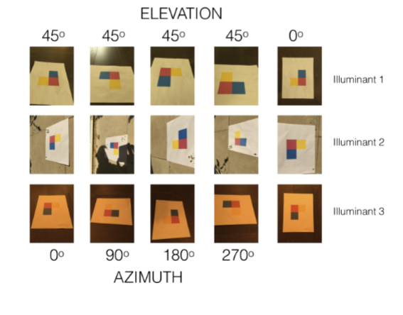
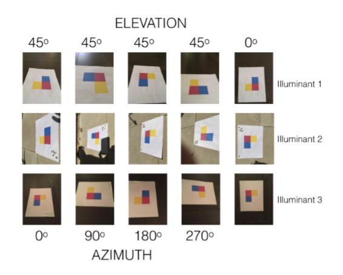
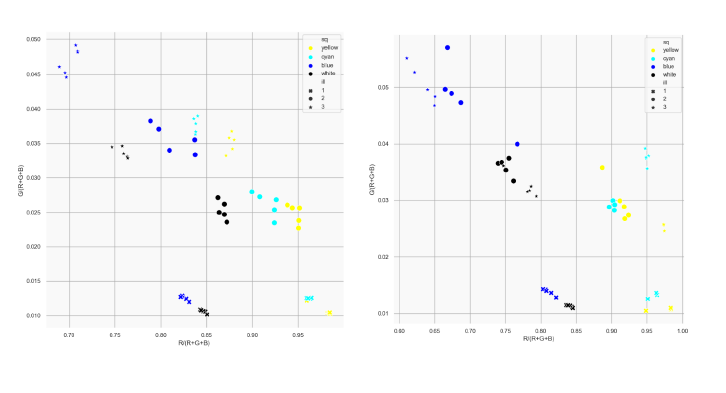
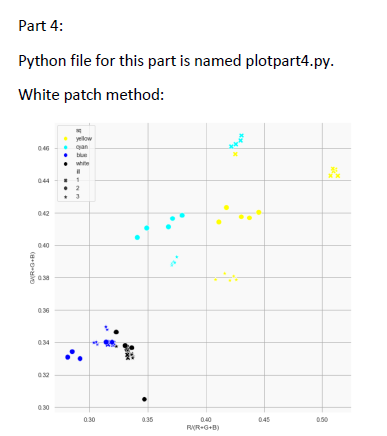

# Color Constancy Project

## Overview
This project explores color constancy, focusing on the variation of colors under different light conditions and camera settings. It's articulated in four parts, each examining different aspects of color constancy and camera radiometry.

### Contents
- **Task 1: Camera Radiometric Calibration**
  - The resource inside the folder details the approach to deduce the non-linear function in smartphone cameras, specifically focusing on radiometric calibration. It includes graphs in the 'data.xlsx' file (Sheet 1), employing Excel's regression tools on the gathered data. Notably, the blue channel exhibits an unusual shape, hypothesized to be due to the bluish tint of the non-Lambertian paper used. Images corresponding to this data are located in a designated folder. The Google Pixel 3A was utilized for photography under bright light, with the white balance set to cloudy mode.
- **Task 2: Test Pattern Photography**
  - Part 2 of the project involves creating a color test pattern, either by printing or assembling a mosaic with different colored materials, and photographing it under various conditions. This includes taking 30 pictures using different light sources, from multiple angles, and with varying white balance settings. The objective is to capture the pattern's appearance in diverse lighting and perspectives, ensuring consistent exposure and avoiding over-saturation. The task requires manual exposure settings and post-capture linearization of color channel values, focusing on capturing the true color representation under each condition.
- **Task 3: Color Distribution Study**
  - Part 3 of the project, "Color Distribution Study," involves analyzing the normalized values of color channels. The task requires computing R' and G' for all linearized color values and creating plots to illustrate their distribution. These plots, differentiated by illuminants (ill index) and square colors (sq index), are made for both automatic and preset white balance settings. The distribution patterns, especially the spread of data points, offer insights into surface properties, noise levels, and the impact of different illumination types on color perception. This part is crucial for understanding how various factors influence color representation in images.
- **Task 4: Color Constancy Experiments**
  - "Color Constancy Experiments," explores using color constancy algorithms to standardize colors in images taken under different lighting conditions without white balance (wb=0). The goal is to apply transformations to make colors appear consistent across varying illuminants. This involves calculating a distinct diagonal color transformation matrix for each illuminant, aiming to cluster the transformed colors in a way that minimizes their dependency on the light source. The experiment highlights the effectiveness of color constancy algorithms in achieving uniform color perception under diverse lighting.

